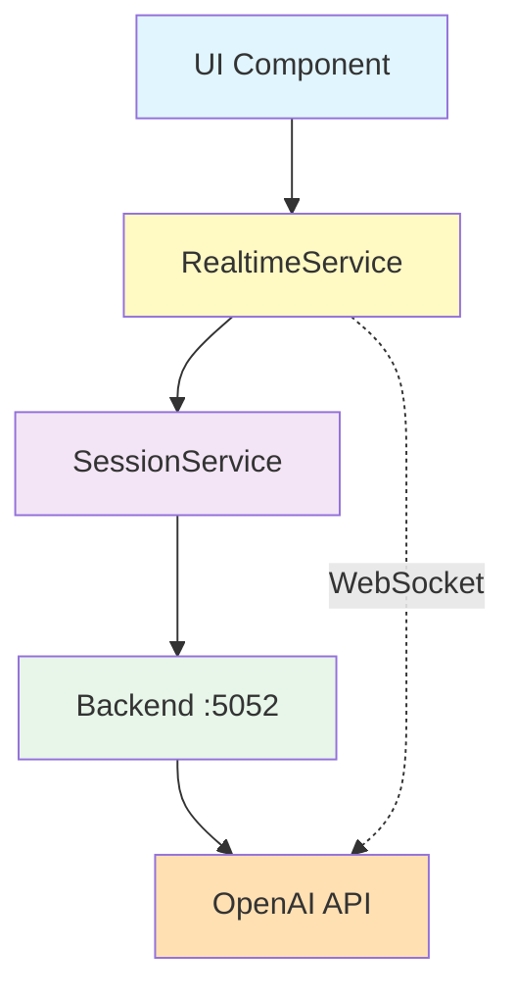
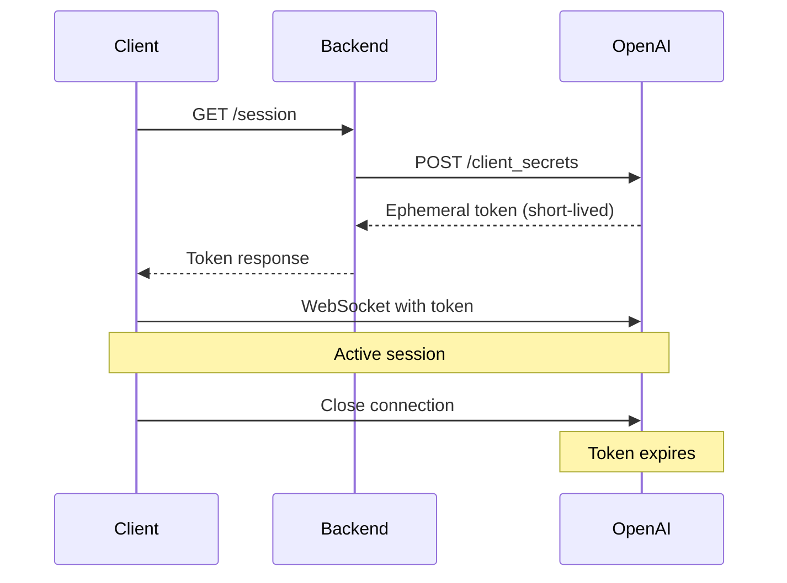

# 🎙️ OpenAI Realtime Voice Assistant System Documentation

## 📋 Table of Contents
1. [System Overview](#system-overview)
2. [Architecture](#architecture)
3. [Backend Configuration](#backend-configuration)
4. [Frontend Implementation](#frontend-implementation)
5. [Data Structures](#data-structures)
6. [API Flow](#api-flow)
7. [Known Issues & Solutions](#known-issues--solutions)
8. [Code Examples](#code-examples)
9. [Testing Guide](#testing-guide)

---

## 🌟 System Overview

### Purpose
Voice-powered product catalog assistant using OpenAI's Realtime API with dual output:
- **Audio Response**: Natural conversational speech
- **JSON Metadata**: Structured product data (not mentioned in audio)

### Key Technologies
- **Frontend**: TypeScript, RealtimeService (Singleton Pattern)
- **Backend**: Node.js, Express, OpenAI Realtime API
- **Protocol**: WebSocket for real-time communication
- **Auth**: Ephemeral token generation

### Project Structure
```
📁 asesor-interface/ (Frontend)
  └── RealtimeService.ts     # Main service for voice interaction
  └── SessionService.ts       # Token management (referenced)

📁 audio-transcriptor-backend/ (Backend)
  └── ephemeral-session.js   # Token generation endpoint
  └── productAgent.json       # Product catalog (if exists)
```

---

## 🏗️ Architecture

### System Components



### Communication Flow
1. **Token Request**: UI → RealtimeService → SessionService → Backend
2. **Token Generation**: Backend → OpenAI `/v1/realtime/client_secrets` endpoint
3. **WebSocket**: RealtimeService ↔ OpenAI Realtime API (persistent connection)
4. **Dual Output**: Audio stream + JSON metadata returned separately

---

## ⚙️ Backend Configuration

### Environment Variables (.env)
```bash
OPENAI=sk-xxxxxxxxxxxxxxxx  # Your OpenAI API key
EPHEMERAL_PORT=5052         # Backend server port
```

### Endpoint Details
```javascript
// Backend Server
URL: http://localhost:5052/session
Method: GET
Headers: {
  "Access-Control-Allow-Origin": "*"  // CORS enabled for development
}

// OpenAI API Call (CORRECTED)
URL: https://api.openai.com/v1/realtime/client_secrets  // ✅ Correct endpoint
Body: {
  "session": {
    "type": "realtime",
    "model": "gpt-realtime"
  }
}
```

### ⚠️ Critical Fix Applied
```diff
- const r = await fetch("https://api.openai.com/v1/realtime/sessions", {  // ❌ Wrong
+ const r = await fetch("https://api.openai.com/v1/realtime/client_secrets", {  // ✅ Correct
```

---

## 💻 Frontend Implementation

### RealtimeService.ts Structure

```typescript
class RealtimeService {
  // Singleton instance
  private static instance: RealtimeService;
  
  // Connection state
  private session: RealtimeSession<any> | null = null;
  private isConnecting: boolean = false;
  private isConnected: boolean = false;
  
  // Event callbacks
  private connectionCallbacks: {
    onConnected?: () => void;
    onDisconnected?: () => void;
    onError?: (error: Error) => void;
    onMessage?: (message: any) => void;
    onMetadata?: (metadata: any) => void;      // For JSON product data
    onAudioResponse?: (audio: any) => void;    // For voice response
  }
  
  // Main methods
  async connect(callbacks?): Promise<void>
  async disconnect(): Promise<void>
  async sendMessage(message: string): Promise<void>
  private setupEventListeners(): void
  private createAgent(): RealtimeAgent<any>
}
```

### Agent Configuration

```typescript
// Voice Assistant Instructions
name: "VoiceAssistant"
purpose: "Product catalog assistant with dual output"

// Response Strategy:
1. AUDIO: Brief, natural conversation (e.g., "I found a great washing machine for you!")
2. METADATA: Full JSON structure with all product details (never spoken)

// Current Product Database:
- SmartWash Pro 500 Front Load Washer (hardcoded example)
```

---

## 📊 Data Structures

### Product JSON Format

```json
{
  "TextMessage": "Written summary different from audio response",
  "JsonData": {
    "jsonType": "ProductsCollection",
    "products": [
      {
        "sku": "WM-2024-X500",
        "name": "SmartWash Pro 500 Front Load Washer",
        "brand": "CleanTech",
        "profilePic": "smartwash_pro_500_profile.jpg",
        "description": "Ultra-efficient 5.0 cu.ft. front load washing machine...",
        "price": 899.99,
        "rate": 4.7,
        "discount": 15,
        "images": [
          "washer_front_view.jpg",
          "washer_control_panel.jpg",
          "washer_drum_interior.jpg"
        ],
        "Link3D": "http://example.com/3d/smartwash",
        "LinkAR": "http://example.com/ar/smartwash",
        "LinkVideo": "http://example.com/video/smartwash",
        "TechnicalSheet": "http://example.com/tech/smartwash.pdf",
        "FAQS": [
          {
            "question": "What's the capacity?",
            "answer": "5.0 cubic feet, perfect for large families"
          }
        ]
      }
    ]
  }
}
```

### Event Types from OpenAI

```typescript
// Main events to listen for:
'conversation.item.completed'  // Complete response ready
'response.output_item.done'    // Output item finished
'response.function_call_arguments.done'  // If using functions
'error'  // Error occurred
'close'  // Connection closed
```

---

## 🔄 API Flow

### Connection Sequence

```typescript
// 1. Initialize connection
await RealtimeService.connect({
  onConnected: () => console.log("✅ Connected"),
  onMetadata: (data) => {
    // Handle product JSON
    updateProductDisplay(data.JsonData.products);
  },
  onAudioResponse: (audio) => {
    // Play audio to user
    playAudioStream(audio);
  }
});

// 2. Send user query
await RealtimeService.sendMessage("Show me washing machines");

// 3. Receive dual response
// - Audio: "I found a great washing machine for you..."
// - Metadata: { TextMessage: "...", JsonData: { products: [...] } }

// 4. Disconnect when done
await RealtimeService.disconnect();
```

### Token Lifecycle



---

## 🐛 Known Issues & Solutions

### ✅ Resolved Issues

| Issue | Solution | Status |
|-------|----------|--------|
| Wrong endpoint `/realtime/sessions` | Changed to `/realtime/client_secrets` | ✅ Fixed |
| CORS errors | Added CORS headers in backend | ✅ Fixed |
| JSON in prompt formatting | Properly structured with examples | ✅ Fixed |

### ⚠️ Pending Implementation

| Feature | Description | Priority |
|---------|-------------|----------|
| Dynamic Products | Currently only 1 hardcoded product | High |
| Event Parsing | Better separation of audio/metadata | High |
| SessionService.ts | Not included in shared code | Medium |
| Auto-reconnect | Handle connection drops | Medium |
| Token Caching | Reduce API calls | Low |

---

## 💡 Code Examples

### Basic Usage

```typescript
// Initialize service
const realtimeService = RealtimeService.getInstance();

// Connect with handlers
await realtimeService.connect({
  onConnected: () => {
    setConnectionStatus('connected');
  },
  
  onMetadata: (metadata) => {
    // Update UI with product data
    if (metadata.JsonData?.products) {
      renderProducts(metadata.JsonData.products);
    }
    
    // Show text message
    if (metadata.TextMessage) {
      displayTextMessage(metadata.TextMessage);
    }
  },
  
  onAudioResponse: (audio) => {
    // Handle audio playback
    audioPlayer.play(audio);
  },
  
  onError: (error) => {
    console.error('Connection error:', error);
    showErrorNotification(error.message);
  }
});

// Send a query
await realtimeService.sendMessage("I need a washing machine for a large family");

// Check connection status
const status = realtimeService.getConnectionStatus();
console.log('Status:', status);
// Output: { isConnected: true, isConnecting: false, hasSession: true }
```

### Advanced: Wait for Metadata Response

```typescript
async function queryWithResponse(query: string): Promise<any> {
  return new Promise((resolve, reject) => {
    let metadataReceived = false;
    
    // Temporary metadata handler
    const originalHandler = realtimeService.connectionCallbacks.onMetadata;
    
    realtimeService.connectionCallbacks.onMetadata = (data) => {
      metadataReceived = true;
      // Restore original handler
      realtimeService.connectionCallbacks.onMetadata = originalHandler;
      resolve(data);
    };
    
    // Send query
    realtimeService.sendMessage(query).catch(reject);
    
    // Timeout after 10 seconds
    setTimeout(() => {
      if (!metadataReceived) {
        realtimeService.connectionCallbacks.onMetadata = originalHandler;
        reject(new Error('Timeout waiting for response'));
      }
    }, 10000);
  });
}

// Usage
try {
  const response = await queryWithResponse("Show me your best washer");
  console.log('Products received:', response.JsonData.products);
} catch (error) {
  console.error('Query failed:', error);
}
```

---

## 🧪 Testing Guide

### Manual Testing Steps

1. **Start Backend**
   ```bash
   cd audio-transcriptor-backend
   npm start
   # Should see: "Ephemeral session server listening on http://localhost:5052/session"
   ```

2. **Test Token Generation**
   ```bash
   curl http://localhost:5052/session
   # Should return JSON with client_secret
   ```

3. **Frontend Connection Test**
   ```javascript
   // In browser console
   await RealtimeService.connect({
     onConnected: () => console.log('✅ CONNECTED'),
     onError: (e) => console.error('❌ ERROR:', e)
   });
   ```

4. **Query Test**
   ```javascript
   await RealtimeService.sendMessage("Show me washing machines");
   // Should receive audio + metadata
   ```

### Expected Responses

```javascript
// Successful connection
{
  isConnected: true,
  isConnecting: false,
  hasSession: true
}

// Product query response
{
  TextMessage: "I found this high-efficiency washing machine...",
  JsonData: {
    jsonType: "ProductsCollection",
    products: [/* product array */]
  }
}
```

---

## 📝 Important Notes for AI Agents

### When Modifying This System:

1. **NEVER change the endpoint** from `/v1/realtime/client_secrets`
2. **Maintain dual output structure** (audio + metadata)
3. **Preserve singleton pattern** in RealtimeService
4. **Keep product JSON format** consistent
5. **Test token generation** before WebSocket connection

### Common Pitfalls to Avoid:

- ❌ Don't use `/v1/realtime/sessions` endpoint
- ❌ Don't mention JSON data in audio responses
- ❌ Don't create multiple RealtimeService instances
- ❌ Don't forget to handle both audio and metadata events
- ❌ Don't cache tokens (they're ephemeral by design)

### Environment Requirements:

- Node.js 14+ for backend
- TypeScript 4+ for frontend
- Valid OpenAI API key with Realtime API access
- WebSocket support in browser

---

## 🚀 Quick Start Checklist

- [ ] Backend `.env` file has `OPENAI` key
- [ ] Backend running on port 5052
- [ ] Frontend can reach `http://localhost:5052`
- [ ] RealtimeService imported correctly
- [ ] Event handlers implemented for audio/metadata
- [ ] Error handling in place
- [ ] Test with "Show me washing machines" query

---

## 📚 Additional Resources

- [OpenAI Realtime API Docs](https://platform.openai.com/docs/guides/realtime)
- [WebSocket MDN Documentation](https://developer.mozilla.org/en-US/docs/Web/API/WebSocket)
- [@openai/agents-realtime NPM Package](https://www.npmjs.com/package/@openai/agents-realtime)

---

*Document Version: 1.0*  
*Last Updated: Current System State*  
*Prepared for: AI Agent Handoff*  
*System: OpenAI Realtime Voice Assistant with Product Catalog*